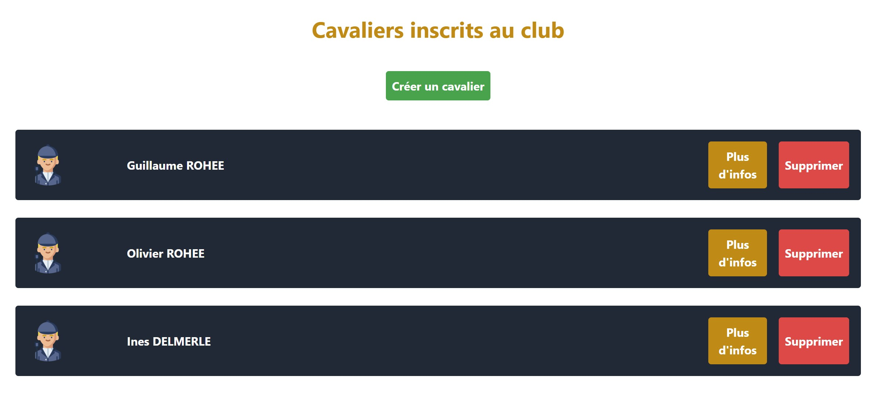
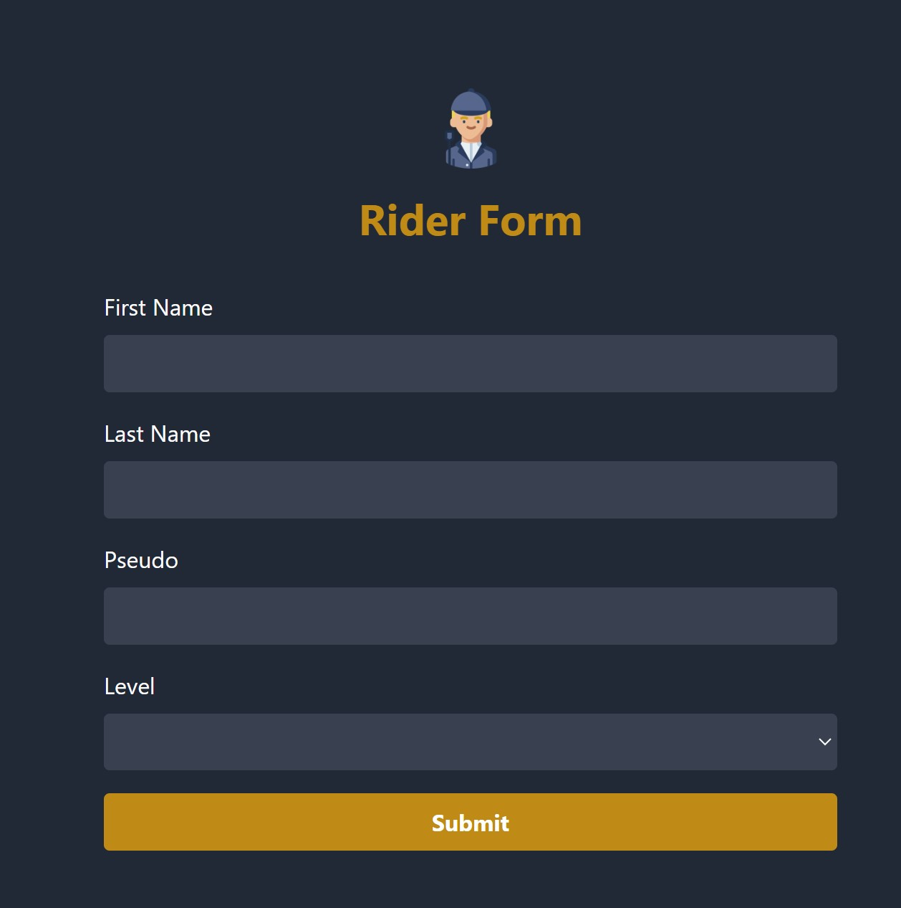
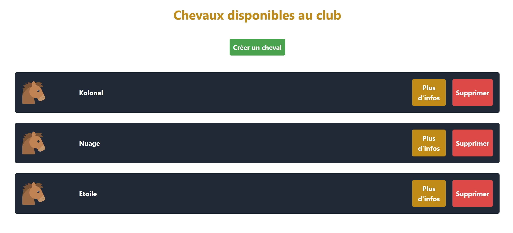
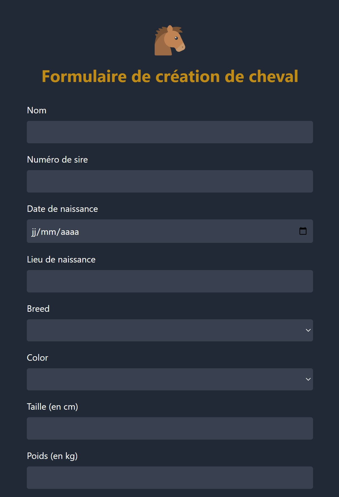
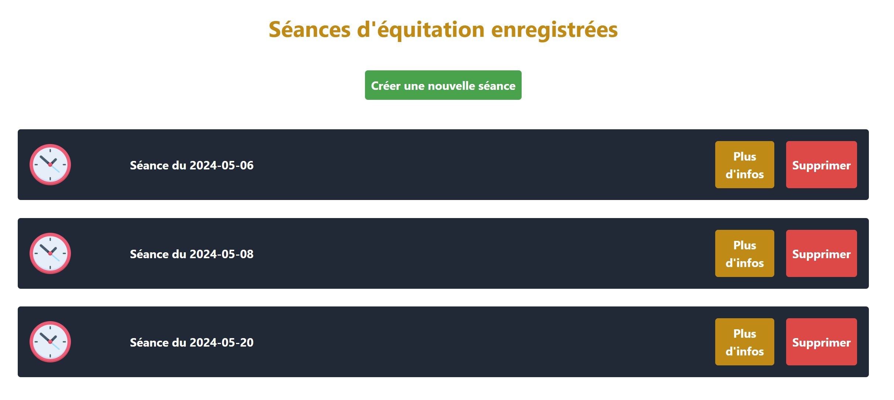
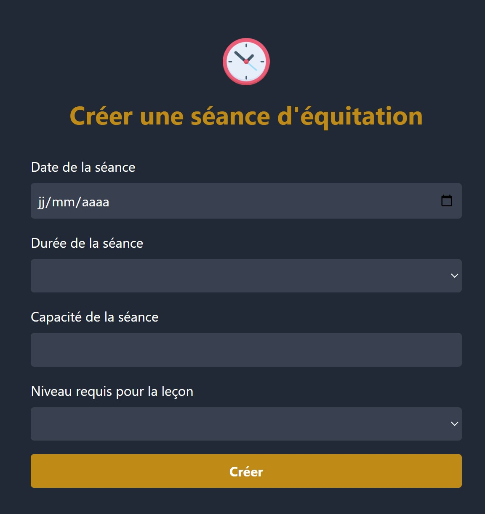
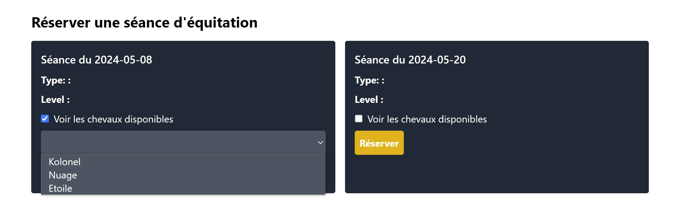
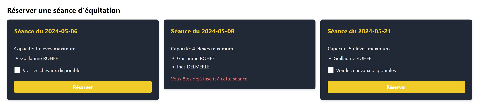

# EquiIT - An ERP dedicate to horse riding

**The project is composed of three parts :**

- The backend application, a Spring Boot application
- The frontend application, an Angular application
- The infrastructure, a docker-compose file to setup mariadb and keycloak (with a dedicated postgres database)

## How to run the project

### Prerequisites

- `docker` and `docker-compose`
- `IntelliJ IDEA` or another IDE to run the backend and `Java 17`
- `Node.js` and `npm` to run the frontend with `Angular CLI` and `TailwindCSS`

### Steps

1. Clone the two repositories in the same folder
2. Setup the infrastructure with docker-compose
    - Go to the frontend repository
    - `cd infra` and `docker-compose up -d`
3. Run the backend application
    - Go to IntelliJ IDEA
    - Open the backend project
    - Run the application
    - The backend is running on `localhost:8080`
4. Run the frontend application
    - Go to the frontend repository
    - `npm install`
    - `npm start`
    - The frontend is running on `localhost:4200`

**If you want to access to Keycloak admin console, go to `localhost:8888` with `admin` as login and `Password123` as password.**

## Features

## Authentication and user management

The project uses Keycloak as authentication server. You can create an account and login with it. The project is composed of two roles : `USER` and `ADMIN`.

The `ADMIN` role can access to the admin panel and manage the users. It is dedicated to teachers and administrators of the riding school.

The `USER` role can access to the main features of the application. It is dedicated to the riders.

**As the project is in development, the registration of a user in the app is not binded with the Keycloak server : the administrator has to create the user in the Keycloak admin console and in the app in order to login.**

## Riders management

The application allow to create and delete riders. The riders are the users that can book a riding lesson.

The application embeds an interface to view the riders and details about them. It is also possible to create and delete a rider through this interface.

**Rider overview interface :**

**Rider creation interface :**

## Horses management

The application allow to create and delete horses. The horses are the animals that can be used for a riding lesson.

The application embeds an interface to view the horses and details about them. It is also possible to create and delete a horse through this interface.

**Horse overview interface :**

**Horse creation interface :**

## Riding lessons management

The application allow administrators (with `ADMIN` role in `keycloak`) to create and delete riding lessons. The riding lessons are the lessons that can be booked by the riders.

**Riding lesson overview interface :**

**Riding lesson creation interface :**

Once a riding lesson is created, the riders can book it on the application under some conditions :

- The rider has to be logged in
- The rider has to check a box in order to tell if he has a horse or not
- If the rider hasn't a horse, he has to choose one in the list of available horses
- If the rider is already booked in a riding lesson at the same time, he can't book another one

**The level of the rider is not taken into account in the booking process for the moment.**

The binding between the rider and the riding lesson is done using the `keycloak` token. The rider can only book a riding lesson if he is logged in on both the application and the `keycloak` server. The binding is done using the `preferred_username` field in the token : the username of the rider in the application is the same as the username in the `keycloak` server. So, when a user book a riding lesson, the application checks if the `preferred_username` field in the token is the same as the username of the rider in the application and add the rider to the riding lesson if it is the case.

**Riding lesson booking interface :**

## Default credentials

### Keycloak

- `admin` / `Password123!`

### Fake users

**Admins :**

- `johnmarston2011` / `Password123!`
- `arthur_morgan` / `Password123!`

**Users :**

- `guigui0812` / `Password123!`
- `olivier_rohee` / `Password123!`
- `ines_dlmr` / `Password123!`

**Hope you will enjoy the project !**

*This project is a work in progress and is not finished yet. The features are not fully implemented and the project is not production ready.*
